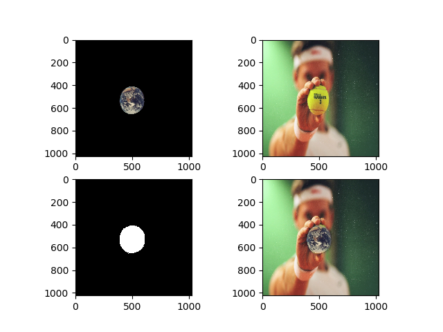

# **Pyramid Blending** #
Pyramid representation, is a type of multi-scale signal 
representation developed by the computer vision, image processing and signal
processing communities, in which a signal or an image is subject to repeated
smoothing and subsampling. This use in image processing in several tasks, 
such as efficient search of details in an image, efficient search of specific 
image in images, and blending of images.
Using blending with pyramids gives us more smooth border.
Here I implement the blending using the gaussian and laplacian pyramids

Example of the blemdimg:

